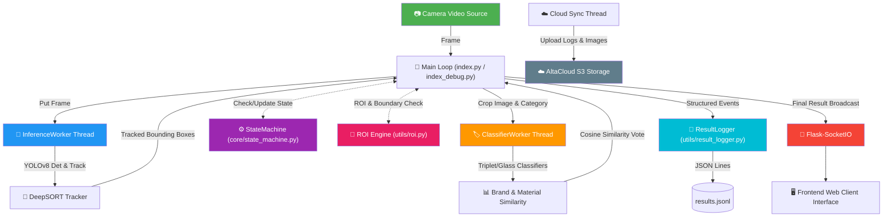

# 🤖 RVM-Vision: Reverse Vending Machine Computer Vision Pipeline

RVM-Vision is a production-ready, high-performance computer vision system designed for **Reverse Vending Machines (RVMs)**. It automates the detection, tracking, volume estimation, and brand classification of recyclable plastic bottles and aluminum cans in real-time. 

Using **YOLO26s** for detection, **DeepSORT** for object tracking, a custom **Triplet Embedding Network** for plastic bottle brand matching, and a **PyTorch CNN** binary classifier for glass bottle identification, the system operates asynchronously via multi-threading to ensure high framerates and minimal latency.

---

## 📐 Sytem Architecture & Data Flow

The pipeline is designed with a **Separation of Concerns (SoC)** approach. Bounding-box detection, object tracking, and brand embedding estimation run on concurrent thread workers to keep the main video capture loop unblocked.



---

## 🌟 Key Features

1. **State Machine Lifecycle Management (`core/state_machine.py`)**
   - Thread-safe state transitioning using `RLock`: `IDLE` (idle standby) $\rightarrow$ `ARMED` (listening for virtual line crossing) $\rightarrow$ `DETECTING` (collecting frame classification samples) $\rightarrow$ `IDLE` (finalizing).
   - Abort policies for emergency events (e.g., human hand intervention, unidentified bottle brand classification, or out-of-bounds volume detection).

2. **Multithreaded Inference Pipeline**
   - **`InferenceWorker`**: Runs YOLOv8 object detection (`best_19thg6.pt` or `best_13thg5.onnx`) and updates DeepSORT tracks asynchronously.
   - **`ClassifierWorker`**: Crops tracked objects and runs inference on a Triplet Loss Embedding Network (`mbnv2_embedding19thg3.pth` or `model.onnx`) using Cosine Similarity database matching, or glass classification.

3. **ROI & Virtual Line Engine (`utils/roi.py`)**
   - Monitors physical boundaries using a configurable Region of Interest.
   - Triggers the voting/classification pipeline when a tracked item's center crosses the **Virtual line** and the object is completely inside the scanner frame.

4. **Volume & Hierarchical Decision Routing**
   - Estimates item volume (`utils/hierarchy.py`) in milliliters based on bounding box aspect ratios and physical distance pixel scaling factors.
   - Rejects items immediately if estimated volume falls outside acceptable thresholds (e.g., `< 180ml` or `> 550ml`).
   - Uses hierarchical logical rules to determine the final recycle label (`Aquafina`, `Standard Plastic`, `Can`, `Glass`, `Metal Other`, `Plastic Other`, or `Reject`).

5. **Safety & Security Measures**
   - **Hand Safety Abort**: Instantly aborts scanning and rejects the transaction if the YOLO model detects a human hand (`HAND` class) inside the ROI.
   - **Credential Isolation**: S3 cloud access keys, endpoints, and bucket details are loaded securely from a local `.env` environment file.
   - **Graceful Shutdown**: Automatically traps termination signals (`SIGINT`, `SIGTERM`), releases the webcam resource, stops background threads safely, and performs a final cloud synchronization.

---

## 📁 Repository Structure

```text
rvm-vision/
├── core/
│   ├── __init__.py
│   └── state_machine.py     # Thread-safe detection lifecycle manager (IDLE, ARMED, DETECTING)
├── workers/
│   ├── inference.py         # Thread worker for YOLOv8 object detection & DeepSORT tracking
│   └── classifier.py        # Thread worker for brand matching & classification models
├── utils/
│   ├── camera_utils.py      # Independent thread for camera I/O and device discovery
│   ├── helper_functions.py  # Helper functions (cropping, matrix operations)
│   ├── hierarchy.py         # Hierarchical classification rules and volume estimation
│   ├── hud.py               # HUD overlay and bounding box visualization helper
│   ├── result_logger.py     # Writes structured recycling transactions to results.jsonl
│   ├── roi.py               # Virtual line crossing and ROI bounding logic
│   └── types.py             # Strongly-typed data definitions (e.g., DetectionBox)
├── deep_sort/               # Built-in DeepSORT tracking library
├── tests/                   # Automated Pytest suite
│   ├── test_hierarchy.py
│   ├── test_result_logger.py
│   ├── test_roi.py
│   └── test_state_machine.py
├── config.py                # Centralized configuration hyperparameters & thresholds
├── index.py                 # Flask-SocketIO Web Server (Production mode)
├── index_debug.py           # Offline desktop developer script with OpenCV HUD preview
├── s3_worker.py             # Synchronizes local daily images and logs to S3 storage
└── tracker.py               # High-level coordinates tracking coordinator
```

---

## ⚙️ Configuration & Environment Settings

Create a `.env` file in the root directory by copying the template file:

```bash
cp .env.example .env
```

Open `.env` and fill in your AWS/AltaCloud S3 storage credentials:

```ini
# ===== S3 / Object Storage Configuration =====
RVM_S3_BUCKET=rvm-storage
RVM_S3_ENDPOINT=https://s3.altacloud.biz:443
RVM_S3_ACCESS_KEY=your-access-key-here
RVM_S3_SECRET_KEY=your-secret-key-here
```

Custom model weights should be placed inside directories mapping to those defined in [config.py](file:///Users/trannhutquang/PycharmProjects/PlasticCanCls/rvm-vision/config.py):
- YOLO Object Detector: `best_weights/best_19thg6.pt`
- Brand Embedder: `best_weights/mbnv2_embedding19thg3.pth`
- Glass Classifier: `best_weights/best_binary_classifier.pth`
- Reference Brand Embedding Database: `best_embeddings/brand_database.npz`

---

## 🚀 Getting Started

### 1. Prerequisites
Ensure you have Python 3.8+ installed. It is highly recommended to run the project in a virtual environment:

```bash
# Create a virtual environment
python3 -m venv venv

# Activate virtual environment (macOS/Linux)
source venv/bin/activate
```

### 2. Install Dependencies
Install all required libraries specified in [requirement.txt](file:///Users/trannhutquang/PycharmProjects/PlasticCanCls/rvm-vision/requirement.txt):

```bash
pip install -r requirement.txt
```

### 3. Running in Production Mode (Web UI Integration)
To run the production server with the Flask-SocketIO framework and Eventlet networking:

```bash
python index.py
```
This launches a backend server that streams camera logs, state flags, and transaction results to the frontend web application. It also hosts a `/health` endpoint to monitor real-time statistics like FPS, inference latency, system uptime, and state.

```bash
curl http://localhost:5000/health
```

### 4. Running in Local Developer/Debug Mode (OpenCV UI)
To test and debug the pipeline locally using a direct OpenCV visualization window:

```bash
python index_debug.py
```
Press `q` on your keyboard to exit the debug window.

---

## 🧪 Automated Testing

The project has comprehensive test coverage targeting the core state machine transitions, ROI coordinates validation, volume estimations, and structured logging.

Run the test suite using **pytest**:

```bash
pytest tests/
```

The testing suite completes rapidly (~0.04 seconds) validating **61 test cases**:
- `test_roi.py`: Center containment, virtual line crossings, and completeness.
- `test_state_machine.py`: State flow cycles, voting accumulation, abort rules, and size averaging.
- `test_result_logger.py`: Logging structure validity and I/O.
- `test_hierarchy.py`: Volume formulas and brand evaluation routing.

---

## 📊 Result Logging Output Format
Every successfully recycled item or safety rejection writes a JSON Lines entry into `results.jsonl` in the following structured format:

```json
{"timestamp": "2026-06-22 17:42:00", "data": 0, "mac_id": "rvm_device_01", "images": ["temp/2026-06-22/img1.jpg"], "size": 84.5, "volume": 350.0}
{"timestamp": "2026-06-22 17:42:15", "data": 7, "mac_id": "rvm_device_01", "images": [], "size": 0.0, "volume": 120.0, "reason": "Volume out of bounds"}
```
*(Data classes map directly to RVM class codes: `0` for Aquafina, `1` for Standard Plastic, `2` for Can, `7` for Reject/Invalid)*
